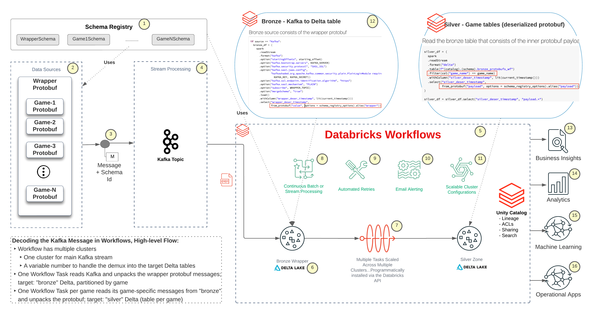

# Delta Live Tables Consuming Protobuf with an Evolving Schema 

_Descriptions for the numbered, yellow circles are found in the [appendix](#appendix)_

# Learning Objectives
In this blog post you will learn about:
* How [protocol buffers](https://developers.google.com/protocol-buffers) ("protobuf") are a compact serialization format
* How [Delta Live Tables](https://www.databricks.com/product/delta-live-tables) ("DLT") pipelines provide a feature-rich platform for your ETL pipelines
* How to write a DLT pipeline to consume protobuf values from an Apache Kafka stream.
* How the [Confluent Schema Registry](https://docs.confluent.io/platform/current/schema-registry/index.html) is leveraged for decoding the binary message payload
* Addressing schema evolution in the DLT pipeline


# Streaming Use Cases
The [Lakehouse platform](https://www.databricks.com/product/data-lakehouse) is a unified Data-to-AI platform for the enterprise where data engineers, data analysts, business analysts, and data scientists collaborate in a single platform. Streaming workloads in [Delta Live Tables](https://www.databricks.com/product/delta-live-tables) pipelines can power near real-time prescriptive and [predictive analytics](https://www.databricks.com/glossary/predictive-analytics) and automatically retrain Machine Learning (ML) models using [Databricks built-in MLOps support](https://www.databricks.com/blog/2022/06/22/architecting-mlops-on-the-lakehouse.html). The models can be exposed as [scalable, serverless REST end-points](https://docs.databricks.com/mlflow/serverless-real-time-inference.html), all within the Databricks platform.

The data that makes up these streaming workloads may have many origins, from a variety of use cases. Examples of streaming use cases include:
|Streaming Data|Use Case|
|----|----|
|IoT sensors on manufacturing floor equipment|Generating predictive maintenance alerts and preemptive part ordering|
|Set-top box telemetry|Detecting network instability and dispatching service crews|
|Player metrics in a game|Calculating leader-board metrics and detecting cheat|

This data is often streamed through open source messaging layers to handle the transmission of the data payload from producers to consumers. [Apache Kafka](https://docs.databricks.com/structured-streaming/kafka.html) is a widely used messaging platform used for such payloads.

## Optimizing the Streaming Payload Format
Databricks Lakehouse provides capabilities that help optimize the AI journey by unifying Business Analysis, Data Science and Data Science activities in a single, governed platform. And when we consider optimizing the end-to-end technology stack, we naturally consider the serialization format of the message payload as one element of the stack subject to optimization.

The remainder of this blog post will focus on using an optimized format, created by Google, called [protocol buffers](https://developers.google.com/protocol-buffers). It will also explain how to harness the power of [Databricks Delta Live Tables](https://www.databricks.com/product/delta-live-tables) for its [autoscaling capabilities](https://docs.databricks.com/workflows/delta-live-tables/delta-live-tables-concepts.html#databricks-enhanced-autoscaling) and ETL pipeline features, such as [orchestration, cluster management, monitoring, data quality, and error handling](https://docs.databricks.com/workflows/delta-live-tables/delta-live-tables-concepts.html). Lastly, this blog post will explore the concept of [schema evolution](https://docs.databricks.com/ingestion/auto-loader/schema.html#how-does-auto-loader-schema-evolution-work) in the context of streaming workloads.

### What Makes Protobuf an "Optimized" Serialization Format?
Google enumerates the [advantages of protocol buffers](https://developers.google.com/protocol-buffers/docs/overview) as follows:
* Compact data storage
* Fast parsing
* Availability in many programming languages
* Optimized functionality through automatically-generated classes

A key aspect of the optimization usually involves use of pre-compiled classes that are used in the consumer and producer programs that a developer would write. In a nutshell, consumer and producer programs that leverage protobuf's are "aware" of a message structure, and the binary payload of a protobuf message benefits from:
* Positioning within the binary message, removing the need for field markers or delimiters
* Primitive data types

The client and producer programs leverage the compiled protobuf descriptions. The [protoc compiler](https://github.com/protocolbuffers/protobuf#protocol-compiler-installation) is used to compile those definitions into classes in a variety of languages, including Java and Python. For this example, the DLT code manages the compilation of the protocol definitions, and it will leverage Python as the target language for the compiler. To learn more about how protocol buffers work, go here: https://developers.google.com/protocol-buffers/docs/overview#work.

## Optimizing the Streaming Runtime
In addition Delta Live Tables (DLT) benefits for ETL development, DLT overcomes a limitation in Spark Structured Streaming architectures that involves the downscaling of the compute resources (see [“Downscaling: The Achilles heel of Autoscaling Apache Spark Clusters”](https://www.youtube.com/watch?v=XA_oVcoK7b4) for more information). There are some known work-arounds that address the downscaling challenge (for example, [“A Self-Autoscaler for Structured Streaming Applications in Databricks”](https://medium.com/gumgum-tech/a-self-autoscaler-for-structured-streaming-applications-in-databricks-a8bc4601d1d1)). However, these work-arounds require additional complexity, code, and management.

So, DLT is a natural choice for long-running streaming workloads with variable volume. It will scale up and down the compute resources using [Enhanced Autoscaling](https://docs.databricks.com/workflows/delta-live-tables/delta-live-tables-concepts.html#databricks-enhanced-autoscaling).

## Handling Payload Schema Evolution
Earlier we briefly described protobuf schema and how the protocol definition must be compiled into classes (e.g. Python or Java). This presents a challenge for those trying to design a continuously streaming application that handles the evolution of the schema.

### Exploring Payload Formats for IoT Streaming Data
Before we proceed, it is worth mentioning that JSON or Avro may be suitable alternatives for streaming payload. These formats offer benefits that, for some use cases, may outweigh protobuf's.
#### JSON
JSON is a great format for development because it is mostly human-readable. The other formats we'll explore are binary formats and require tools to inspect the underlying data values. Unlike Avro and protobuf, however, the JSON document is stored as a large string (potentially compressed) and this means more bytes may be used than what a value actually represents. Consider the short int value of 8. A short int typically requires two bytes. In JSON, you may have a document that looks like the following, and it will require a number of bytes for the associated key, quotes, etc.:
```
{
  "my_short": 8
}
```
Considering all the characters used above, we're looking at 17 bytes. When we consider protobuf, we would expect 2 bytes plus a few more, perhaps, for the overhead related to the positioning metadata.

##### JSON Support in Databricks
On the positive side, JSON documents have a rich set of benefits when used with Databricks. [Databricks Autoloader](https://docs.databricks.com/ingestion/auto-loader/index.html) can easily transform JSON to a structured DataFrame while also providing built-in support for:
* Schema inference - you can supply a schema when reading JSON into a DataFrame so that the target DataFrame or Delta table has the desired schema. Or you can let the engine [infer the schema](https://docs.databricks.com/ingestion/auto-loader/schema.html#syntax-for-schema-inference-and-evolution). [Schema hints](https://docs.databricks.com/ingestion/auto-loader/schema.html#override-schema-inference-with-schema-hints) can be supplied, alternatively, if want a balance of those features.
* [Schema evolution](https://docs.databricks.com/ingestion/auto-loader/schema.html#how-does-auto-loader-schema-evolution-work) - Autoloader provides options for how a workload should adapt to changes in the schema of incoming files.

Consuming and processing JSON in Databricks is simple. To create a Spark DataFrame from JSON files can be as simple as this:
```
df = spark.read.format("json").load("example.json")
```

#### Avro
Avro is an attractive serialization format because it is compact, it encompasses schema information in the files itselft, and it has [built-in support in Databricks that includes schema registry integration](https://docs.databricks.com/structured-streaming/avro-dataframe.html). [This tutorial](https://www.confluent.io/blog/consume-avro-data-from-kafka-topics-and-secured-schema-registry-with-databricks-confluent-cloud-on-azure/), co-authored by Databricks' Angela Chu, walks you through an example that leverages Confluent's Kafka and Schema Registry.

To explore an Avro-based dataset, it is as simple as working with JSON:
```
df = spark.read.format("avro").load("example.avro")
```

### Protobuf
[This datageeks.com article](https://dataforgeeks.com/data-serialisation-avro-vs-protocol-buffers/2015/) compares Avro and protobuf. It is worth a read, if you are on the fence between Avro and protbuf. Regarding performance, it describes protobuf as the "fastest amongst all". If speed outweighs other considerations, such as JSON and Avro's greater simplicity, protobuf may be the best choice.

# Overcoming Challenges when using Protobuf
Let's summarize some of the challenges that were briefly touched upon earlier:
* Programs that leverage protobuf have to work with classes that were compiled using protoc. The protoc compiler is not installed, by default, on Databricks clusters
* No built-in support in Spark (as of 2022) for consuming protobuf.
* In a streaming application with protobuf messages that have evolving schema, protoc has to be leveraged as the application runs

Now, let's walk through these challenges and describe how they can be overcome.

## Compiling the Protobuf Schema
The `protoc` call is costly, so we want to minimize the use. Ideally, it should be invoked once per schema version id. 

### Solution
To solve the challenge, the following is needed:
1. The protobuf compiler needs to be installed on the cluster. To solve this, an [init script](https://docs.databricks.com/clusters/init-scripts.html) can be used to manage the installation of the protoc compiler on the cluster's worker nodes. The script will be run as new nodes are provisioned and before the worker is made available to the Spark runtime.

<br/>
*Code Example: init script to install the protobuf compiler*
<br/>

```
#!/bin/sh
PB_REL="https://github.com/protocolbuffers/protobuf/releases"
curl -LO $PB_REL/download/v21.5/protoc-21.5-linux-x86_64.zip
unzip protoc-21.5-linux-x86_64.zip -d /usr/local/
```
Note: in DLT, you can configure the init script up by editing the JSON definition of the DLT pipeline.

2. As micro batches are processed, DLT may scale the cluster up or down. This means that the ability to receive the binary payload and decode it (using a compiled protobuf schema) needs to avoid the need to recompile the protobuf schema repeatedly. To address this, a function like the one below can help ensure the compiling action is minimized (by checking for the existence of the generated Python class). When used within an UDF, the distribution of the logic to new nodes will ensure the compilation happens once.

<br/>
*Code Example: Compile once*
<br/>

```
def get_message_type(version_id, schema_str):
  mod_name = f'destination_{version_id}_pb2'

  tmpdir = "/tmp"
  fname = f"destination_{version_id}.proto"
  fpath = f"{tmpdir}/{fname}"
  mname = f'{fname.replace(".proto", "_pb2")}'

  if (not os.path.exists(f"{mname}.py")):
    f = open(fpath, "w")
    f.write(schema_str)
    f.close()
    retval = os.system(f"protoc -I={tmpdir} --python_out={tmpdir} {fpath}")
    print(f"retval: {retval} for path {fpath} for schema_str {schema_str}")
    if (retval != 0):
      raise Exception(f"protoc bombed with {retval}")
  if (tmpdir not in sys.path):
    sys.path.insert(0, tmpdir)
  
  pkg = importlib.import_module(mname)  

  return pkg
```

Notice the part with `protoc -I={tmpdir} --python_out={tmpdir} {fpath}`... This line of code makes a system call to invoke the protobuf compiler (protoc).

## Handling an Evolving Schema
The schema of the protobuf messages may evolve over time. Also, at any given time, the stream may consist of messages with a variety of schemas.

### Solution
To handle schema evolution, the following steps are taken:
Upon pipeline initialization, a call is made to the Confluent Schema Registry. This latest known schema version is captured.


<br/>
*Code Example: get latest schema_id from the Schema Registry*
<br/>

```
src = SchemaRegistryClient(schema_registry_conf)
raw_versions = src.get_versions(f"{TOPIC}-value")
latest_id = src.get_latest_version(f"{TOPIC}-value").schema_id
```

The latest Schema Id is looked up during the startup of the DLT pipeline. If a newer version is detected, the code for the DLT pipeline in this tutorial will cause the pipeline to fail. When a DLT pipeline is set to run in [Production mode](https://docs.databricks.com/workflows/delta-live-tables/delta-live-tables-concepts.html#development-and-production-modes) and it fails, the DLT pipeline will eventually restart and will use the newer Schema Id as it sets up the pipeline and target Delta table.


# Example Code to Demonstrate Schema-evolving ProtoBuf Messages and Consuming them in Databricks DLT
The purpose of this prototype is to demonstrate how you can stream protobuf messages into Databricks DLT and handle evolution of the schema with the help of the Confluent schema registry.

### Disclaimer Regarding the Example Code
Example code is provided for demonstration purposes as part of this blog. The code is not an officially supported part of Databricks. It is for instructional purposes only. Although it functioned as part of this blog and tutorial, you may have to work through any issues on your own.

## The Code Files
Accompanying [this repo](https://github.com/craig-db/protobuf-dlt-schema-evolution), you will find three code files:
1. Install_DLT_Pipeline - this notebook should be run to install the DLT pipeline.
2. Producer - this notebook will generate fake data and is meant to be run multiple times. It provides a way to send `x` number of messages for `y` different schemas. 
3. DLT - this notebook is the code for the DLT pipeline.

### Read the comments
The code files include commentary and additional links to help you understand the various functions and steps in the process. Read through the comments and pay attention to the notebook cell titles.

# Prerequisites
The following Kafka and Schema Registry connection details (and credentials), should be saved as Databricks Secrets:
- SR_URL: Schema Registry URL (e.g. https://myschemaregistry.aws.confluent.cloud)
- SR_API_KEY: Schema Registry API Key 
- SR_API_SECRET: Schema Registry API Secret 
- KAFKA_KEY: Kafka API Key 
- KAFKA_SECRET: Kafka Secret 
- KAFKA_SERVER: Kafka host:port (e.g. mykafka.aws.confluent.cloud:9092)
- KAFKA_TOPIC: The Kafka Topic
- TARGET_SCHEMA: The target database where the streaming data will be appended into a Delta table (the destination table is named unified_gold)

Go here to learn how to save secrets: https://docs.databricks.com/security/secrets/index.html 

## Kafka and Schema Registry
The code in the example was written and tested using Confluent's hosted Kafka. To obtain a free trial Confluent account, go here: https://www.confluent.io/confluent-cloud/tryfree/. The code may or may not work seamlessly with other Kafka and Schema Registry providers.

# Notebook overview
* The "Producer" notebook creates simulated messages and sends them to a Kafka topic. Use the widget values to increase the number of different schema versions used in the flow and the number of records sent per notebook run.
* The "DLT" notebook will be installed as a Continuous DLT Pipeline.
* The "Install_DLT_Pipeline" notebook will install the aforementioned DLT notebook.

# Instructions
1. Run the "Producer" notebook. This will publish some messages to Kafka. The notebook also installs a script in DBFS that will be used by the DLT notebook. That "init script" will ensure that the protobuf compiler (protoc) is installed on the cluster that runs the DLT pipeline.
2. Run the "Install_DLT_Pipeline" notebook.
3. Go back to the "Producer" notebook. Adjust the widget values (e.g. increase the number of versions). If the DLT pipeline is configured to run in "Production" mode, you should be able to see the job automatically restart the pipeline.

# How it works
* When the DLT pipeline starts, it keeps track of the current maximum version schema identifier that it received from a call to the Confluent Schema Registry.
* If a newer Schema Identifier is detected, the pipeline fails. It should restart itself (assuming you use "Production" mode for the DLT pipeline).
* The reason the stream restarts is so that the target sink schema can get updated to the latest schema from the Schema Registry.

### Clean up
Stop and delete the job, pipeline and drop the target schema.

# Conclusion
Optimized IoT systems optimize across the technology stack. In this blog, we reviewed how an optimized serialization format, protobuf, can be leveraged with Delta Live Tables when the protobuf payload has evolving or varying schemas. Delta Live Tables provides an optimized ETL framework for organizing the landed payload, transforming it, and preparing it for consumption in the unified Databricks Lakehouse.

## Repo
The code for this example is located here in github: https://github.com/craig-db/protobuf-dlt-schema-evolution

# Appendix
1. A Schema Registry, such as [Confluent's Schema Registry](https://docs.confluent.io/platform/current/schema-registry/index.html), provides a metadata service for streaming message services, such as Confluent's implementation of [Apache Kafka](https://kafka.apache.org/). For protobuf messages, where the payload that streams does not include a schema definition, a Schema Registry provides a way for message producers and consumers to be aware of the message fields. Confluent's Schema Registry supports schema evolution; each schema version has its own Schema Id.
2. The program(s) that publish messages to the message bus leverage the Registry Schema, along with a Serializer, to prepare messages for the message bus. In the case of protobuf, Confluent's [ProtobufSerializer](https://docs.confluent.io/platform/current/schema-registry/serdes-develop/serdes-protobuf.html) is leveraged. In this demo, take a look at the [Producer](./Producer.py) notebook to see how simulated messages are generated and published to Kafka.
3. When a serializer, such as the ProtobufSerializer, is used to prepare messages for publishing, the serializer is used in conjunction with a SerializingProducer to build a message that includes a Schema Id in the binary payload that is published in the message. This means that every message will include a few bytes that allow the consumer to decode the Schema Id.
4. Apache Kafka is a messaging service that can be run on your own hardware. However, cloud-based, fully managed options exist for running Kafka, such as Confluent Cloud and [Amazon MSK](https://aws.amazon.com/msk/). This demo uses Confluent's fully managed Kafka implementation.
5. Databricks [Delta Live Tables](https://www.databricks.com/product/delta-live-tables) makes it easy to build and manage reliable data pipelines that deliver high-quality data on Delta Lake. DLT helps data engineering teams simplify ETL development and management with declarative pipeline development, automatic data testing, and deep visibility for monitoring and recovery.
6. [Delta Lake](https://delta.io/) is an open-source storage framework that enables building a [Lakehouse architecture](https://www.databricks.com/product/data-lakehouse). Databricks recommends organizing tables using the [Medallion Lakehouse Architecture](https://docs.databricks.com/lakehouse/medallion.html). Think of the "gold" layer tables as the "high quality", consumable tables.
7. Delta Live Tables provides [built-in Data Quality capabilities](https://docs.databricks.com/workflows/delta-live-tables/delta-live-tables-expectations.html). You use expectations to define data quality constraints on the contents of a dataset. An expectation consists of a description, an invariant, and an action to take when a record fails the invariant. You apply expectations to queries using Python decorators or SQL constraint clauses.
8. Delta Live Tables supports [pipelines that are continuous or triggered](https://docs.databricks.com/workflows/delta-live-tables/delta-live-tables-concepts.html#continuous-and-triggered-pipelines). Triggered pipelines update each table with whatever data is currently available and then stop the cluster running the pipeline. Continuous pipelines update tables continuously as input data changes.
9. Delta Live Tables tries to minimize operational overhead and human intervention in [Production mode](https://docs.databricks.com/workflows/delta-live-tables/delta-live-tables-concepts.html#development-and-production-modes). The system (a) restarts the cluster for specific recoverable errors, including memory leaks and stale credentials; and (b) retries execution in the event of specific errors, for example, a failure to start a cluster. 
10. Delta Live Tables provides [observability features for your ETL pipelines](https://docs.databricks.com/workflows/delta-live-tables/delta-live-tables-event-log.html). An event log is created and maintained for every Delta Live Tables pipeline. The event log contains all information related to the pipeline, including audit logs, data quality checks, pipeline progress, and data lineage. You can use the event log to track, understand, and monitor the state of your data pipelines.
11. With Delta Live Tables, [table maintenance is automatically scheduled](https://docs.databricks.com/workflows/delta-live-tables/delta-live-tables-faqs-issues.html#does-delta-live-tables-perform-maintenance-tasks-on-my-tables). Databricks [automatically upgrades the Delta Live Tables runtime](https://docs.databricks.com/workflows/delta-live-tables/delta-live-tables-manage-upgrades.html) to support enhancements and upgrades to the platform. 
12. Instead of low-level hand-coding of ETL logic, data engineers can leverage SQL or Python to build declarative pipelines – easily defining ‘what’ to do, not ‘how’ to do it.  With DLT, they specify how to transform and apply business logic, while DLT automatically manages all the dependencies within the pipeline.
13. Databricks Delta Live Tables populate Delta tables. These tables can be leveraged via [Databricks SQL](https://www.databricks.com/product/databricks-sql) for interactive queries, for building [dashboards](https://docs.databricks.com/sql/user/dashboards/index.html) or for setting [alerts](https://docs.databricks.com/sql/user/alerts/index.html).
14. In addition to Databricks SQL capabilities (mentioned in #13), [Databricks SQL Warehouses](https://docs.databricks.com/sql/admin/sql-endpoints.html) allow other client applications (such as Tableau or Looker) to leverage Delta tables to drive analytics.
15. [MLFlow models can be used in a Delta Live Tables pipeline](https://docs.databricks.com/workflows/delta-live-tables/delta-live-tables-cookbook.html#use-mlflow-models-in-a-delta-live-tables-pipeline) to leverage inference to derive values for target Delta tables.
16. Delta Live Tables can be used in conjunction with other Databricks features to power applications. For example, a Delta Live Table can populate a table that has alerts set on it, and those alerts can [trigger webhooks or PagerDuty alerts](https://docs.databricks.com/sql/admin/alert-destinations.html).
